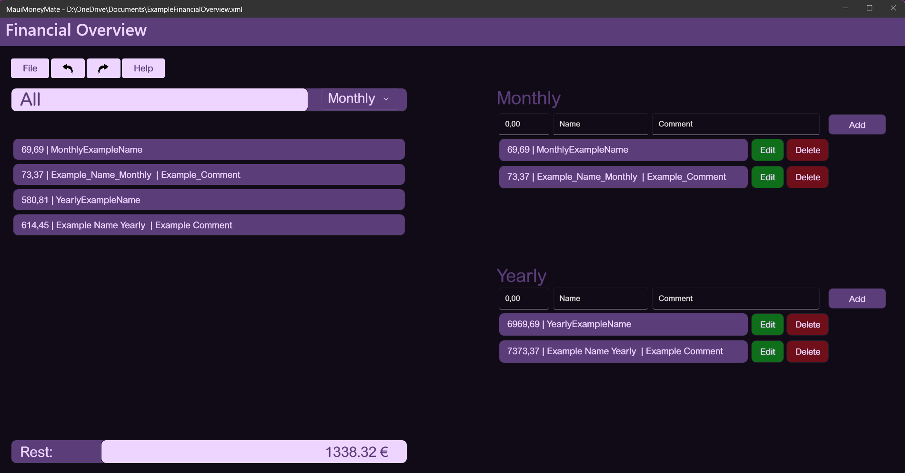
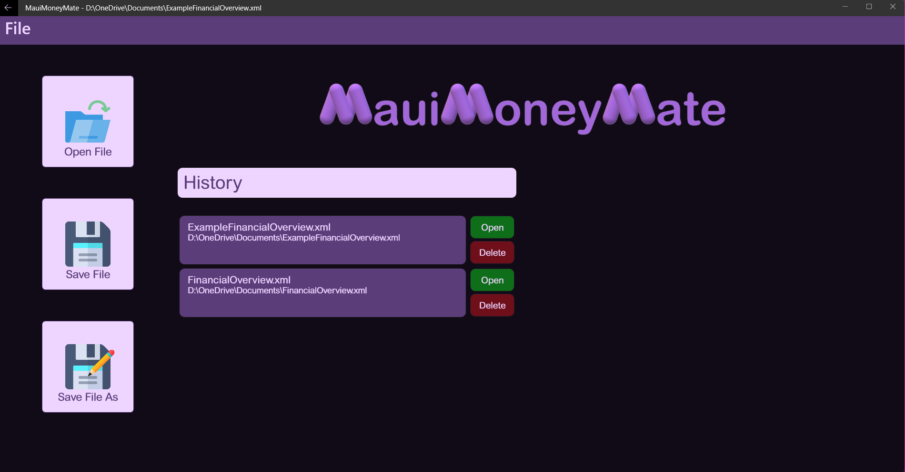
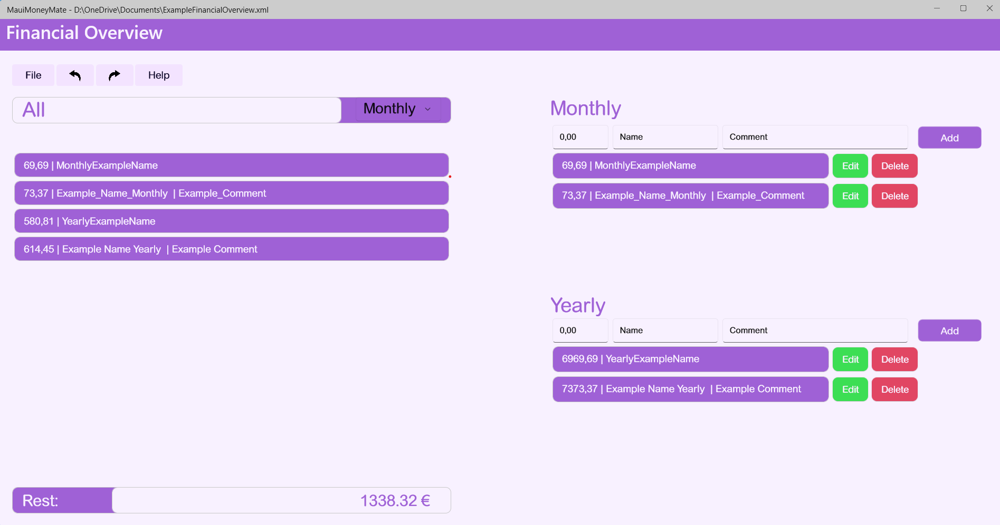
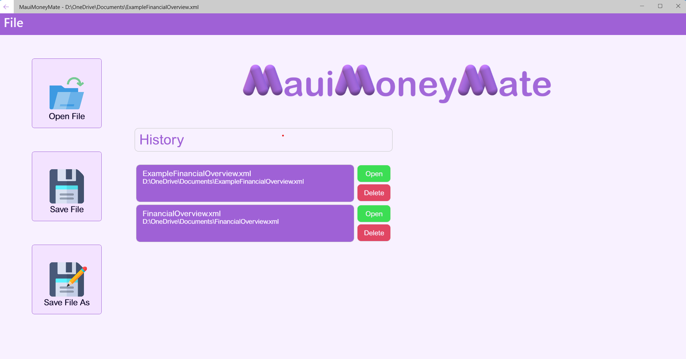

# Financial Overview
A basic overview of your finances, accessible through two different user interfaces: One modern and one 
a bit more classic.

The modern GUI for *FinancialOverview* called '*MauiMoneyMate*' is based on the new .NET Maui Framework. 
It provides the user with a simple but appealing interface to access their financial data, which is stored 
in an .xml file. The destination of this file can be defined by the user, giving the user the possibility 
to save multiple financial files for multiple people, for example.

### Dark Mode

### Light Mode

## WinFormsFinance
The rather old-fashioned looking GUI '*WinFormsFinance*', based on Windows Forms in combination with the 
*Metro Framework*. It offers the user the same possibilities as *MauiMoneyMate*, but with the, as I call 
it, 'old Windows charm'.

## Credits
Especially I want to thank <a href="https://chat.openai.com">ChatGPT</a>, which helped me with the naming of the apps 
and <a href="https://www.craiyon.com/">Craiyon</a>, for designing these wonderful app icons.

